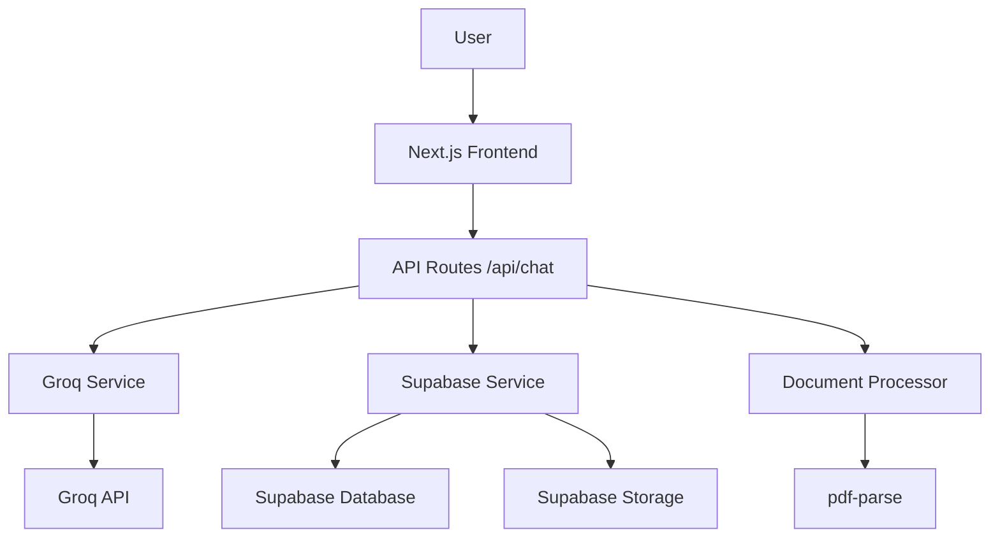

# STEM Companion AI - Personalized Learning Tutor

STEM Companion is a web-based AI chatbot designed to help students master STEM concepts through Socratic tutoring. It uses Groq for fast LLM inference and Supabase for its backend, providing a seamless and intelligent learning experience.

## Features

- **Socratic Tutoring**: Defaults to guiding questions rather than direct answers to help students build intuition.
- **Adaptive Learning**: Detects knowledge gaps and scaffolds prerequisites based on student interaction.
- **Intelligent Document Processing**: Upload PDFs to summarize, explain, and query complex STEM materials.
- **Multi-modal Support**: Ready for math rendering and visual descriptions of STEM diagrams.
- **Resource Curation**: Recommends external links and videos based on student needs.

## Tech Stack

- **Frontend**: React, Next.js (App Router), TypeScript, Tailwind CSS v4, Lucide Icons.
- **Backend**: Next.js API Routes.
- **LLM**: Groq (Llama 3.3 70B / Mixtral).
- **Database/Auth**: Supabase (PostgreSQL).
- **PDF Processing**: `pdf-parse` for text extraction.

## Project Architecture



## Getting Started

### Prerequisites

- Node.js 18+
- Supabase Project
- Groq API Key

### Installation

1. Clone the repository.
2. Install dependencies:
   ```bash
   npm install
   ```
3. Configure environment variables (see `.env.example`):
   ```bash
   cp .env.example .env.local
   ```
4. Run the development server:
   ```bash
   npm run dev
   ```

## Example Conversation Flow

**Student**: "How do I find the derivative of f(x) = sin(x²)?"

**STEM Companion**: "To find the derivative of a function where one function is 'inside' another, like sin(x²), we often use a specific rule. Do you recall the name of the rule used for composite functions?"

**Student**: "Is it the Product Rule?"

**STEM Companion**: "Good thought, but the Product Rule is used when two functions are multiplied together (like x * sin(x)). Here, x² is *inside* the sine function. This is called a composite function. Have you heard of the **Chain Rule**?"

## Database Schema

The initial schema includes:
- `profiles`: User information and learning preferences.
- `conversations`: Chat sessions.
- `messages`: History of interactions with context management.
- `documents`: Metadata and storage references for uploaded materials.

See `supabase_schema.sql` for the full migration script.
